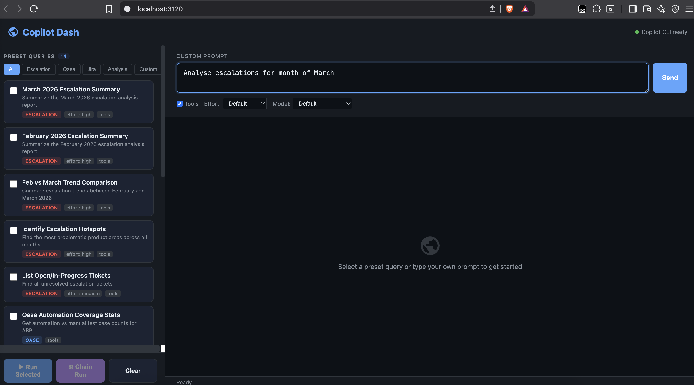
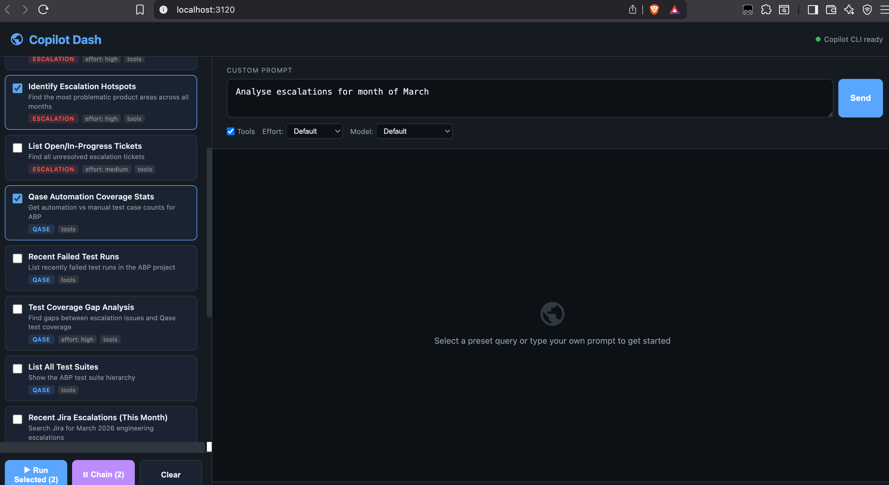

# Escalation Management Pipeline — Automathon Overview

> _An end-to-end, AI-assisted workflow that turns monthly engineering escalations into Confluence documentation, Qase test coverage, and Jira automation tasks — orchestrated by GitHub Copilot._

> **TL;DR.** One Copilot orchestrator runs five chained phases. Each phase reads from / writes to Confluence (single source of truth) and gates on user confirmation before continuing. The pipeline takes raw Jira escalation tickets and produces: an analysis page, a metrics summary, a Qase coverage review, newly-created Qase test cases, and creates Jira automation tasks if needed.

Confluence source: [Escalation Management Pipeline — Automathon Overview](https://paylocity.atlassian.net/wiki/spaces/~712020a9dad8baae464ced9864c735f2724d7c/pages/3116925214/Escalation+Management+Pipeline+Automathon+Overview)

## Why this exists

* Engineering escalations are high-signal data — but the analysis, test-coverage review, and follow-up automation work was previously manual and inconsistent.

* This pipeline turns a one-line ask ("Analyse March 2026 escalations") into a fully documented, reviewed, and actionable work-stream.

* Confluence is the single hub. Every artifact (analysis, summary, coverage review, status) lives on linked pages so any stakeholder can follow along without touching the agent.

## High-level flow

| # | Phase                                 | Reads From              | Writes To                                    | User Gate                 |
| - | ------------------------------------- | ----------------------- | -------------------------------------------- | ------------------------- |
| 1 | Jira Escalation Analysis → Confluence | Jira                    | New Confluence page (analysis)               | Proceed to Phase 2?       |
| 2 | Monthly Escalation Data Summary       | Phase 1 Confluence page | New Confluence page (summary & analytics)    | Proceed to Phase 3?       |
| 3 | Escalation Test Coverage Review       | Phase 1 page + Qase     | Confluence coverage-review table             | Edit table, then proceed? |
| 4 | Creates Confirmed Qase Cases          | Phase 3 review table    | Qase (new cases) + update Confluence         | Need automation?          |
| 5 | Creates Jira Automation Tasks         | Phase 3 review table    | Jira (automation tasks) + updated Confluence | —                         |

## Architecture at a glance

```text
                       ┌──────────────────────────────────┐
                       │   Copilot Orchestrator           │
                       │  (escalation-pipeline-…prompt.md)│
                       └──────────────┬───────────────────┘
                                      │ chains 5 phase-prompts
        ┌─────────────┬───────────────┼─────────────────┬──────────────┐
        ▼             ▼               ▼                 ▼              ▼
   Phase 1        Phase 2         Phase 3           Phase 4         Phase 5
  Jira→Confl.    Summary        Coverage Rev.    Create Qase    Create Jira
        │             │               │                 │              │
        └──── uses shared SKILL.md tooling ───┐         │              │
                                              ▼         ▼              ▼
                                      ┌──────────────────────────────────┐
                                      │  Skills (tools/clients + docs)   │
                                      │  • jira-rest-api                 │
                                      │  • confluence-rest               │
                                      │  • qase-api                      │
                                      └──────────────────────────────────┘
                                              │
                                              ▼
                                ┌─────────────────────────────┐
                                │   Atlassian + Qase Cloud    │
                                │  (Jira • Confluence • Qase) │
                                └─────────────────────────────┘
```

## How to invoke it in VS Code

The pipeline is exposed as a **Copilot Chat slash-command prompt**. Once the repo is open in VS Code, GitHub Copilot Chat picks the prompts up automatically from `.github/prompts/`.

1. **Open Copilot Chat** in VS Code (`⌃⌘I` on macOS, or the Copilot icon in the sidebar).

2. Switch the chat mode to **Agent** (the dropdown next to the chat input). Agent mode is required so Copilot can call the Jira / Confluence / Qase tools.

3. Type `/` in the chat input — VS Code shows all available prompts. Pick `/Escalation-Pipeline-Orchestrator` (or any of the individual phase prompts: `/jira-escalation-to-confluence`, `/monthly-escalation-summary`, `/escalation-test-coverage-review`, `/qase-add-confirmed-cases`, `/qase-automation-jira-tasks`).

4. Provide the inputs in plain English, e.g.:

   * `/Escalation-Pipeline-Orchestrator Do this for March 2026.`

   * `/Escalation-Pipeline-Orchestrator resume https://paylocity.atlassian.net/wiki/spaces/.../pages/3111551235`

5. Approve at each gate by typing `yes`, `proceed`, `skip`, `edit`, or `stop`.

> **Tip.** Run any single phase prompt the same way (`/escalation-test-coverage-review for BP-7672`) when you only need part of the workflow.

### Prerequisites (one-time)

* VS Code with the **GitHub Copilot** + **GitHub Copilot Chat** extensions, set to **Agent** mode.

* `~/.atlassian-credentials` populated with `ATLASSIAN_SITE`, `ATLASSIAN_EMAIL`, `ATLASSIAN_TOKEN` (`chmod 600`). See [.agents/skills/jira-rest-api/SKILL.md](../../.agents/skills/jira-rest-api/SKILL.md).

* Qase API token configured per [.agents/skills/qase-api/SKILL.md](../../.agents/skills/qase-api/SKILL.md).

* Python 3 on PATH (the skill scripts shell out to `python3`).

## Phase-by-phase detail

### Phase 1 — Jira Escalation Analysis → Confluence

**Goal.** Pull every Engineering Escalation ticket for the requested month, classify by product area, and publish a structured analysis page.

* **Input.** Month/year (or explicit JQL), Jira project key (default `BP`), Confluence space + parent page.

* **Steps:**

  1. Build JQL `project = BP AND type = "Engineering Escalation" AND created >= "YYYY-MM-01" AND created <= "YYYY-MM-DD"`.
  2. Fetch full ticket details (reporter, assignee, comments, timestamps).
  3. Infer product area for each ticket from summary + comment history.
  4. Render Confluence storage HTML and create the page.

* **Output.** Confluence URL, page ID stored as `CONFLUENCE_PAGE_ID`.

### Phase 2 — Monthly Escalation Data Summary

**Goal.** Generate analytics from the Phase 1 page and publish a sibling summary page.

* **Input.** `CONFLUENCE_PAGE_ID` from Phase 1.

* **Computes.** Total count, breakdown by product area / priority / status, owner load, repeat customers, average time-to-resolution, trend signals, and recurring root causes.

* **Output.** Summary Confluence page with metric tables and pattern observations; ID stored as `SUMMARY_PAGE_ID`.

### Phase 3 — Escalation Test Coverage Review

**Goal.** For every escalation, check Qase for existing test coverage, score relevancy, and propose new cases.

* **Input.** Phase 1 page + Qase project (default `ABP`).

* **Steps.**

  1. Extract Jira key, title, summary, product area, search keywords from each escalation.
  2. Search Qase progressively: exact phrase → keywords → local filtering → suite inspection.
  3. Score relevancy 0–100% against the highest matching case.
  4. Build a coverage-review table with action columns **Add in Qase** and **Create Jira Task for Automation**, defaulted by relevancy score.

* **Output.** Confluence page (or section) with the coverage-review table; ID stored as `REVIEW_PAGE_ID`. User can edit Yes/No values before continuing.

### Phase 4 — Create Confirmed Qase Cases

**Goal.** Create the user-approved test cases in Qase and update Confluence with status + IDs.

* **Input.** `REVIEW_PAGE_ID`; only rows where _Add in Qase = Yes_.

* **Safety.** Required duplicate check via Qase search; cases >80% relevancy are skipped and reported.

* **Auditing.** Every created case is stamped with the `Created via` custom field (default `AI escalation context`) so AI-generated cases are filterable later.

* **Output.** New Qase case IDs; Confluence row updated to _Done ✅_ with the case link.

### Phase 5 — Create Jira Automation Tasks

**Goal.** Create Jira tasks for cases marked for automation and update Confluence.

* **Input.** `REVIEW_PAGE_ID`; only rows where _Create Jira Task for Automation = Yes_.

* **Asks.** Assignee (or `unassigned`) and target board.

* **Defaults.** Project `BP`, parent issue `BP-7479`, label `bp-velocity`, type `Task`.

* **Output.** New Jira issue keys; Confluence row updated to _Done ✅_ with the Jira link.

## Resume mode

The orchestrator can be resumed from a Confluence URL. It inspects the page for completion markers (analysis content, summary section, review table, "Done ✅" markers in Phase 4/5 columns) and continues from the first incomplete phase after user confirmation.

## User confirmation gates

| Response          | Effect                                         |
| ----------------- | ---------------------------------------------- |
| `yes` / `proceed` | Run the next phase                             |
| `skip`            | Skip the next phase, continue to the one after |
| `edit`            | Modify inputs / table values before proceeding |
| `stop`            | End and emit a partial completion summary      |

## Implementation building blocks

* **Orchestrator prompt.** [.github/prompts/escalation-pipeline-orchestrator.prompt.md](../../.github/prompts/escalation-pipeline-orchestrator.prompt.md)

* **Phase prompts.**

  * [jira-escalation-to-confluence.prompt.md](../../.github/prompts/jira-escalation-to-confluence.prompt.md)

  * [monthly-escalation-summary.prompt.md](../../.github/prompts/monthly-escalation-summary.prompt.md)

  * [escalation-test-coverage-review.prompt.md](../../.github/prompts/escalation-test-coverage-review.prompt.md)

  * [qase-add-confirmed-cases.prompt.md](../../.github/prompts/qase-add-confirmed-cases.prompt.md)

  * [qase-automation-jira-tasks.prompt.md](../../.github/prompts/qase-automation-jira-tasks.prompt.md)

* **Skills (reusable, prompt-agnostic).**

  * [.agents/skills/jira-rest-api/](../../.agents/skills/jira-rest-api/) — Jira REST client, JQL helpers, ticket field reference.

  * [.agents/skills/confluence-rest/](../../.agents/skills/confluence-rest/) — Confluence v2 REST client for pages, comments, attachments.

  * [.agents/skills/qase-api/](../../.agents/skills/qase-api/) — Qase REST client for projects, suites, cases, custom fields.

* **Credentials.** Single shared `~/.atlassian-credentials` file for Jira + Confluence; Qase token via env / config. Remains in User directory, not shared.

## Skills — the toolbox the prompts call

A **skill** in this repo is a self-contained folder under `.agents/skills/<name>/` that bundles three things:

1. A `SKILL.md` description that Copilot loads on demand — explaining when to use the skill, the available commands, risk tiers (safe / moderate / dangerous), and idiomatic invocation patterns.
2. A `scripts/` directory with a thin Python CLI that wraps the underlying REST API.
3. A shared credential / config contract (env vars, dotfile, etc.) so every prompt in the repo authenticates the same way.

Prompts (`.github/prompts/*.prompt.md`) deliberately stay **stateless and high-level** — they describe _what_ to do. Skills supply the _how_, and Copilot binds the two together at invocation time. This separation means the same skill is reusable across many prompts, and a new skill can be added without touching any existing prompt.

| Skill                                                      | Backing API                           | Risk-tiered commands (highlights)                                                                                                                            | Used by                            |
| ---------------------------------------------------------- | ------------------------------------- | ------------------------------------------------------------------------------------------------------------------------------------------------------------ | ---------------------------------- |
| [`jira-rest-api`](../../.agents/skills/jira-rest-api/)     | Jira Cloud REST v3 (Basic Auth)       | Safe: `search`, `view`, `get-transitions`, `search-users`. Moderate: `create`, `update`, `assign`, `transition`, `add-comment`, `link`. Dangerous: `delete`. | Phases 1, 5 + ad-hoc JQL questions |
| [`confluence-rest`](../../.agents/skills/confluence-rest/) | Confluence Cloud REST v2 (Basic Auth) | Page / blog-post CRUD, body-format control (`storage` / `view`), children & ancestors, comments (footer + inline), tasks, labels, attachments.               | All phases (Confluence is the SoT) |
| [`qase-api`](../../.agents/skills/qase-api/)               | Qase v1 + QQL                         | Cases, suites, runs, results, projects, custom fields. Special handling for the singular `custom_field` map quirk (see the skill's `SKILL.md`).              | Phases 3, 4                        |

Why this matters:

* **Composable.** Any new prompt can pull in `jira-rest-api` + `confluence-rest` + `qase-api` without re-implementing auth or CLI ergonomics.

* **Auditable.** Every write goes through one CLI per system, so logging / dry-run / risk gating live in one place.

* **Risk-aware.** SKILL.md files explicitly classify destructive vs read-only commands so Copilot knows when to ask before acting.

* **Local-first.** Skills run on the developer's machine using their own tokens — no extra service to host, no extra audit boundary to manage.

## How this is different from Atlassian Rovo

Rovo is a hosted assistant inside Atlassian; this pipeline is a versioned, code-reviewable workflow in the developer's IDE. Rovo answers questions across Jira/Confluence; this pipeline executes a multi-phase, cross-tool plan (Jira → Confluence → Qase → Github) with explicit human gates, and writes artefacts back to all three systems. Choose Rovo for in-Atlassian Q\&A; choose this when you want the workflow itself to live in source control and extend to systems Rovo doesn't reach.

## Future direction

Distilled from the broader vision in _[From Escalations to Organisational Learning: The Context Engine for Engineering Decisions](https://paylocity.atlassian.net/wiki/spaces/~712020664c17db581e43cb8e6097de179c89b7/pages/3064105391/From+Escalations+to+Organisational+Learning+The+Context+Engine+for+Engineering+Decisions)_:

* **Build a searchable repository of monthly escalation analyses** so it acts as a first-aid reference. When a new escalation arrives, check whether it (or something close) has been seen before, what the resolution was, and notify customers / responders faster.

* **Expand from escalation analysis into broader engineering decision workflows.** Capture decision summaries from Slack threads and publish them into the right Confluence doc (e.g. PRDs), so context isn't lost between channels.

* **Add richer cross-system action automation** across backlog, testing, and delivery — beyond Phases 4 / 5. Examples: auto-generated Qase cases tied to PR diffs; Jira ticket creation with assignees inferred from project / role / past involvement; release-readiness roll-ups.

* **Decision-quality and learning-effectiveness metrics.** Measure whether AI-assisted analyses actually shorten time-to-resolution, reduce repeat escalations, and improve coverage gap closure.

* **Reusable cross-functional platform.** Generalize the orchestrator + phase-prompts + shared-skills shape into a pattern other functions (security review, RCA roll-ups, release readiness, incident triage) can clone.

* **Always-on background agent.** Move from "developer types `/Escalation-Pipeline-Orchestrator`" to a scheduled or event-driven agent that runs the analysis the moment a month rolls over (or a new escalation lands), then surfaces the result for human review.

* **Copilot Dash — a non-IDE surface.** A small Express + TypeScript web UI ([`copilot-dash/`](./copilot-dash/)) that exposes the same prompts as a one-click dashboard for non-developers (PMs, QA leads, support). Prompts run on the same Copilot + skills backbone — IDE remains the source of truth, the dash is just a friendlier front door.
 

The long arc: turn Copilot from an IDE assistant into a **Context Engine for Engineering Decisions** — one that can detect risk across the engineering work graph, explain it, act on it, and convert each outcome into reusable organisational memory.

## Final pipeline summary (example)

```text
Pipeline Summary
================
Phase 1 — Escalation Analysis:    ✅ <URL>
Phase 2 — Monthly Summary:        ✅ <URL>
Phase 3 — Coverage Review:        ✅ <URL>
Phase 4 — Qase Cases Created:     ✅ <count> cases
Phase 5 — Jira Automation Tasks:  ✅ <count> tasks

All documentation is on Confluence: <MAIN_URL>
```

## What this unlocks

* **Repeatable.** Same prompt, same outputs every month — no tribal knowledge.

* **Auditable.** Confluence is the durable record; every AI-created Qase case is tagged. Every AI-created Jira ticket is also tagged so that we can filter and modify/audit if needed.

* **Composable.** Each phase prompt + each skill is independently usable for one-off tasks (e.g. ad-hoc coverage review for a single ticket).

* **Human-in-the-loop.** Five explicit gates ensure no Jira/Qase mutation happens without confirmation.

* **Extensible pattern.** The orchestrator + phase-prompts + shared-skills shape can be cloned for any cross-tool workflow (security review, RCA roll-ups, release readiness, etc.).

***

# Scripts in this folder (Phase 4 & Phase 5 helpers)

The scripts under `scripts/escalation-pipeline/` are the reusable, config-driven helpers that the orchestrator invokes for **Phase 4** (bulk-create Qase cases) and **Phase 5** (bulk-create Jira automation tasks). They wrap the existing skills above so a confirmed coverage-review batch can be applied non-interactively, with all inputs checked into source control as a JSON config.

## Layout

```
scripts/escalation-pipeline/
  create_qase_cases.py              # Phase 4 — bulk create Qase cases
  create_jira_automation_tasks.py   # Phase 5 — bulk create Jira tasks
  runs/
    2026-02/
      qase-cases.config.json        # input config used for Feb 2026 batch
      jira-tasks.config.json        # input config used for Feb 2026 batch
      qase_create_results.json      # output: 36 Qase cases created
      jira_automation_results.json  # output: 36 Jira tasks created
```

## Phase 4 — Create Qase cases

```bash
# 1. Snapshot existing Qase cases (used for fuzzy duplicate check)
python3 .agents/skills/qase-api/scripts/qase-rest.py list-cases \
  --project ABP --paginate > /tmp/abp_cases.json

# 2. Build a config (see runs/2026-02/qase-cases.config.json for an example)

# 3. Run
python3 scripts/escalation-pipeline/create_qase_cases.py \
  --config  scripts/escalation-pipeline/runs/2026-02/qase-cases.config.json \
  --output  scripts/escalation-pipeline/runs/2026-02/qase_create_results.json
```

Each case is created with:

* `severity=2`, `priority=1`, `type=3` (regression) — overridable in `defaults`

* `Created via = AI escalation context` (Qase custom field id `142`)

* HTML description linking back to the source Jira ticket

A local Jaccard-similarity duplicate check (threshold `0.80` on word tokens longer than 3 chars) skips obvious duplicates against `existing_cases_json`.

Use `--dry-run` to preview without calling the Qase API.

## Phase 5 — Create Jira automation tasks

```bash
python3 scripts/escalation-pipeline/create_jira_automation_tasks.py \
  --qase-results scripts/escalation-pipeline/runs/2026-02/qase_create_results.json \
  --config       scripts/escalation-pipeline/runs/2026-02/jira-tasks.config.json \
  --output       scripts/escalation-pipeline/runs/2026-02/jira_automation_results.json
```

Per-case behaviour:

* One `Task` per `created` Qase case

* Parent set to `config.parent` (e.g. `BP-7479`), label set to `config.label`

* Assignees distributed **round-robin** across `config.assignees` in input order (with 2 assignees and 36 cases → 18 / 18)

* Description links to both the Qase case and the source escalation, with acceptance criteria for Playwright + `qase('<id>')` wrapper

To find an `account_id`:

```bash
python3 .agents/skills/jira-rest-api/scripts/jira-rest-client.py \
  search-users --query "Name Here" --format table
```

Use `--dry-run` to preview without calling the Jira API.

## Re-running for a new month

1. Copy `runs/2026-02/` to `runs/<YYYY-MM>/`.
2. Replace the `cases` array in `qase-cases.config.json` with that month's approved rows from the Confluence coverage-review table.
3. Update the `parent`, `assignees`, etc. in `jira-tasks.config.json` if needed.
4. Run Phase 4, then Phase 5 (commands above).
5. Update the Confluence page's "Add in Qase" / "Create Jira Task for Automation" columns from the two `*_results.json` files (the orchestrator prompt does this step from the result JSON).
